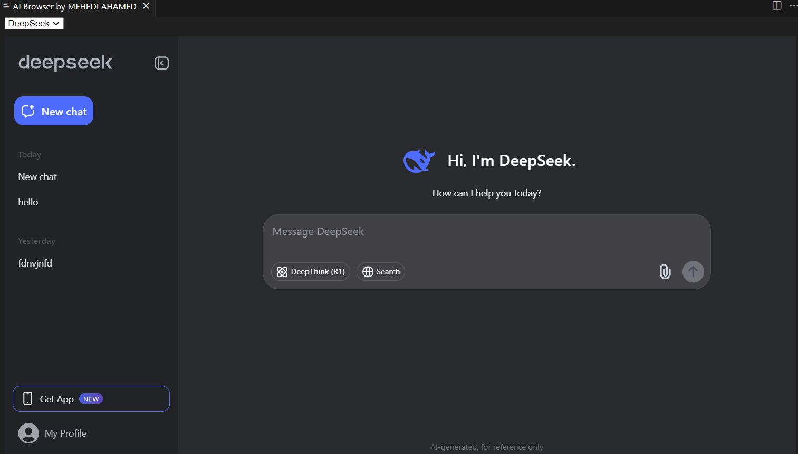
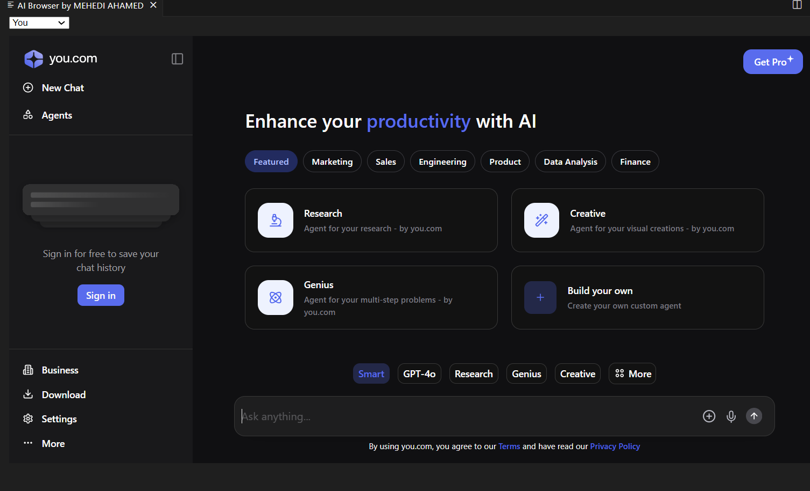
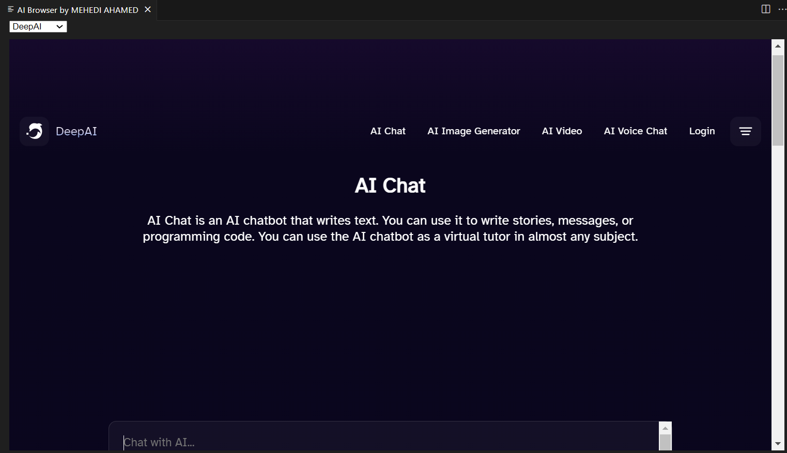

# eliza README

A powerful VS Code extension that allows developers to query, debug, and optimize code using AI assistants like Claude, ChatGPT, and DeepSeek directly within the editor.

## Features

Sign up for popular AI services not offered by Copilot, such as DeepSeek, You, and DeepAI.

## Instructions

1. Install ELIZA.
2. In the status bar below, you will see an AI icon. Press it or use the command palette (CTRL+SHIFT+P) and click "AI Chat".
3. For signing up, do not use Google Authenticator; enter credentials manually.

## Release Notes

In version 0.0.3, a status bar button was added to start the extension, which will be helpful for prompt chatting.

## Working with Markdown

Here are some useful editor keyboard shortcuts:

* Split the editor (`Cmd+\` on macOS or `Ctrl+\` on Windows and Linux)
* Toggle preview (`Shift+Cmd+V` on macOS or `Shift+Ctrl+V` on Windows and Linux)
* Press `Ctrl+Space` (Windows, Linux, macOS) to see a list of Markdown snippets

## About the Publisher

Follow me on:
* [LinkedIn](https://www.linkedin.com/in/mehedi-ahamed-17014b21a)
* [GitHub](https://github.com/MehediAhamed)
* [YouTube](https://www.youtube.com/@mehediunplugged)

## Screenshots

